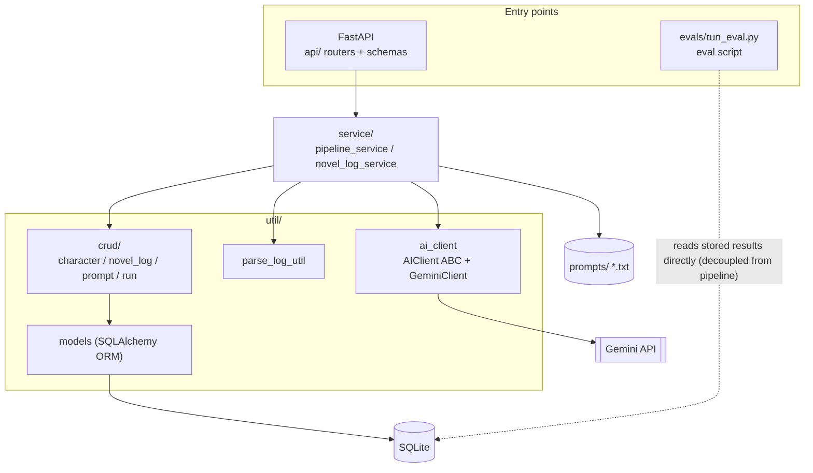
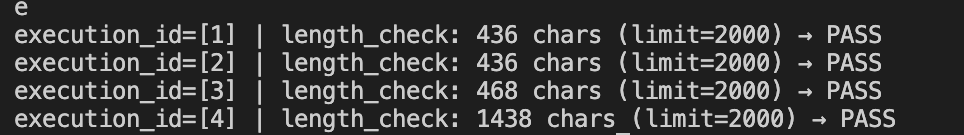
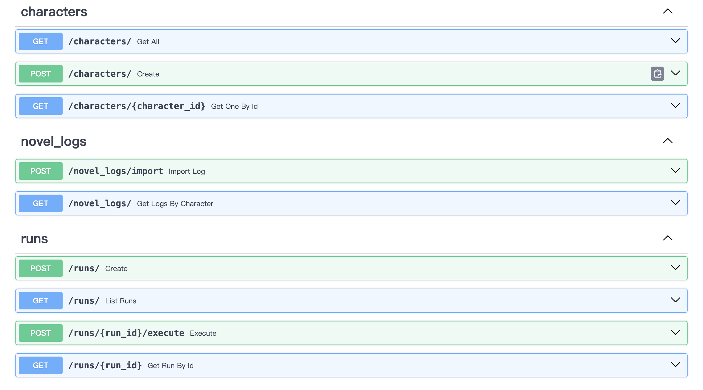
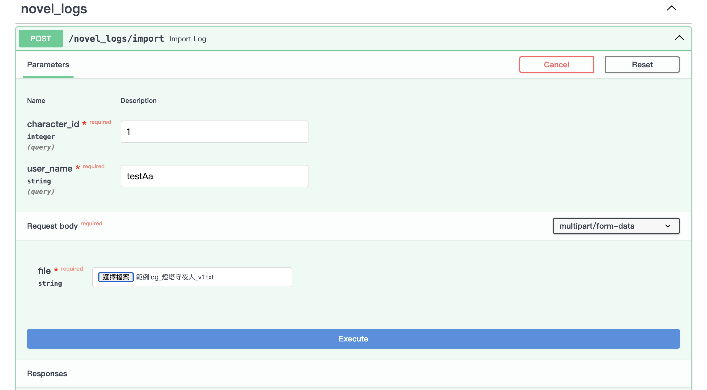
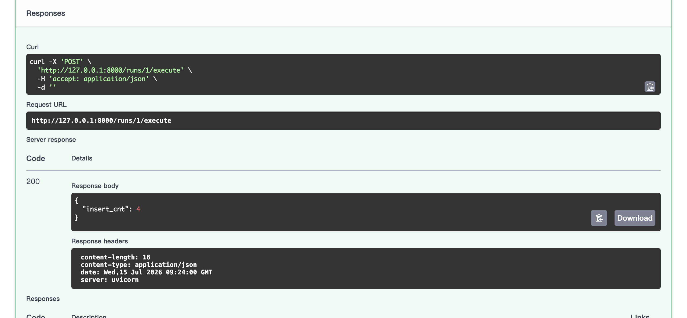
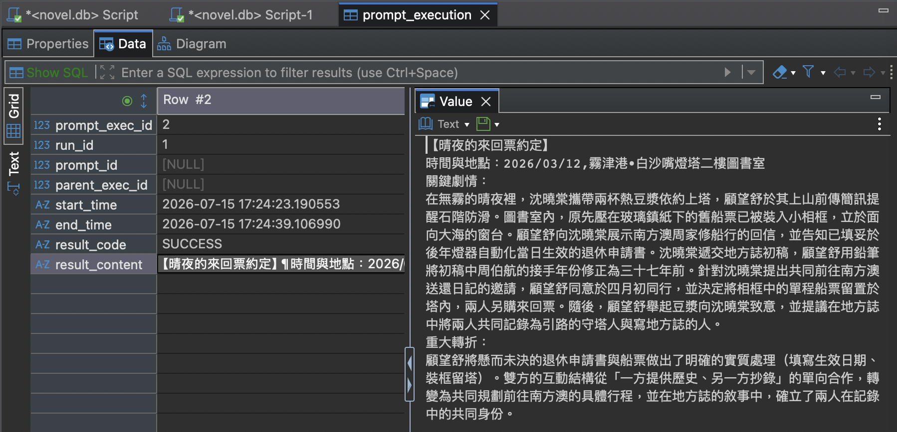

**English** | [中文](README.zh-TW.md)

# Traditional Chinese Long-form Narrative Analysis Pipeline

> Parses long-form Traditional Chinese narrative text (conversational logs) into structured data, then runs an LLM pipeline to batch-produce four analyses — summary, timeline, character relationships, and recap — with output quality checked by a decoupled, rule-based eval framework.

## Motivation

Manually organizing long-form Chinese narrative text (conversational interactive-fiction logs) is expensive: a single segment's analysis scope can easily run 70,000–80,000 characters. Recapping the plot means re-reading the source; tracking character relationships and event timelines relies on manual notes; and the results end up scattered and hard to accumulate.

This project grew out of the author's own need to organize this kind of text, and automates the workflow: raw logs are first parsed and structured into a database, then an LLM pipeline batch-produces results for four analysis purposes (summary / timeline / relationship / recap) and stores them back. The results are therefore queryable, cumulative, and re-runnable — and they also become the data source for eval.

## Architecture

A layered design with one-directional dependencies (entry → business logic → data access):



| Layer | Responsibility |
|---|---|
| `api/` | FastAPI entry: routers (character / novel_log / run) + Pydantic v2 schemas |
| `service/` | Business logic: pipeline execution (run_pipeline), prompt assembly, persisting execution results |
| `util/` | Infrastructure: ai_client (provider abstraction + Gemini implementation), log parsing, DB connection, ORM models |
| `util/crud/` | DAO layer: per-table data access; the caller is responsible for commit |

Also: `prompts/` (plain-text prompt files, with system instruction and prompt sections separated) and `evals/` (rule functions + script entry).

**Dual-entry design**: batch/developer operations go through scripts (`service/novel_log_service.py`'s parsing entry, `evals/run_eval.py`), while service use and interactive testing go through the API (Swagger).

**Tech stack**: Python 3.13, FastAPI, SQLAlchemy ORM, SQLite, Pydantic v2, google-genai

## Design Decisions

### Eval decoupled from the pipeline

Eval doesn't run inside the generation flow; it's a separate developer tool. `evals/run_eval.py` reads already-stored results directly from `prompt_execution.result_content` and runs rule checks — **it does not re-call the LLM API**. This gives three properties:

- New rules can be run repeatedly over the same batch of historical results, at zero extra API cost and without consuming quota
- Adding or changing validation logic doesn't touch the pipeline itself
- The entry point is a script, not an API endpoint — eval is a developer quality tool, not a product feature

The current rule is `length_check` (an output length-limit check; `--execution-id` / `--limit` set via CLI). The rule set deliberately starts with the simplest single rule, to first prove out the "decoupled architecture + read-from-DB check" path; more rules and LLM-as-judge are in the Roadmap.

### AI provider abstraction

`ai_client` defines its interface via the `AIClient` abstract base class, with `GeminiClient` as the current sole implementation. Business logic depends only on the abstraction, so swapping or adding a model provider (e.g., a local Ollama) doesn't touch the service layer.

### Prompts externalized as plain-text files

The prompts for the four analyses live as `.txt` files under `prompts/`, with `# system instruction` and `# prompt` sections separated. Prompt iteration is a high-frequency operation; externalizing it means wording changes don't require code changes, and diffs stay clean.

### Schema reserves rerun traceability

The `prompt_execution` table self-references via `parent_exec_id`: when a failed or low-quality execution is later rerun, the old and new executions can be chained into a traceable lineage rather than overwriting or breaking history. Analysis scope is defined by the `run` table's `range_type` / `range_start` / `range_end`, so the same character can have multiple analysis batches over different ranges.

## Quickstart

Run the full "parse-and-store → four-analysis pipeline → eval" flow on the bundled fictional sample data (~5,000 characters). In real use, a single segment's analysis scope can reach 70,000–80,000 characters.

The sample ships with a set of pre-generated analysis results, so the **core flow (init → eval) needs no Gemini API key**; a key is only needed if you want to re-call the LLM yourself (see "Optional: re-run generation yourself" below).

Requirements: Python 3.13.

```bash
# 1. Install
python -m venv venv
source venv/bin/activate
pip install -r requirements.txt

# 2. Initialize sample data (sample character, analysis batch, four pre-generated results; idempotent)
python -m scripts.seed
```

**3. Run eval** (reads stored sample results; no API call, no key needed):

The `execution_id` for each sample result (seed loads them in the filename order of `examples/results/`):

| execution_id | Analysis type |
|---|---|
| 1 | recap |
| 2 | relationship |
| 3 | summary |
| 4 | timeline |

```bash
python -m evals.run_eval --execution-id 1 --limit 2000
```



### Optional: start the API to browse and import logs (no key needed)

```bash
uvicorn api.app:app --reload
```

Open Swagger UI: <http://127.0.0.1:8000/docs>



**Import a sample log**: `POST /novel_logs/import`, uploading `examples/sample_log.txt` (`character_id=1`; `user_name` can be any value — a field reserved for a future user mechanism). Returns the number of imported rows and writes to `novel_log`. This step demonstrates the parser and needs no API key.



### Optional: preview prompt content (no key needed)

To see the prompt the pipeline actually assembles without calling the LLM, use preview:

`POST /runs/{run_id}/preview` — assembles the four prompts for the seed-created analysis batch and writes them to `data/debug_log/{timestamp}/`. It **does not call Gemini and does not write to the database**; it returns the paths of the debug files written. It runs the same pipeline as `execute` below, differing only in that preview doesn't call the API or persist — so you can inspect the assembled prompt (system instruction and prompt separated, background context filled in) with no key.

### Optional: re-run generation yourself (Gemini API key required)

The bundled analysis results were produced by this step. Re-generating them yourself requires your own key (note: the sample character context is not shipped with this repo, so a rerun's output will differ from the bundled results; full reproducibility is in the Roadmap):

```bash
cp .env.example .env   # fill in GEMINI_API_KEY
```

`POST /runs/1/execute` — runs the four prompts for the seed-created analysis batch, calls Gemini, and writes the results to the `prompt_execution` table.





## Roadmap

- **Eval expansion**: exact-match rules per analysis type, and an LLM-as-judge layer (judge prompt + rubric)
- **Rerun mechanism**: implement failure-rerun via the `parent_exec_id` lineage chain; automatic backoff-retry on transient errors (429/503)
- **Prompt & context management**: move prompts and character context to the DB, evolving toward a customizable, manageable prompt-pipeline system
- **Provider expansion**: integrate a local model (Ollama) on the `AIClient` abstraction