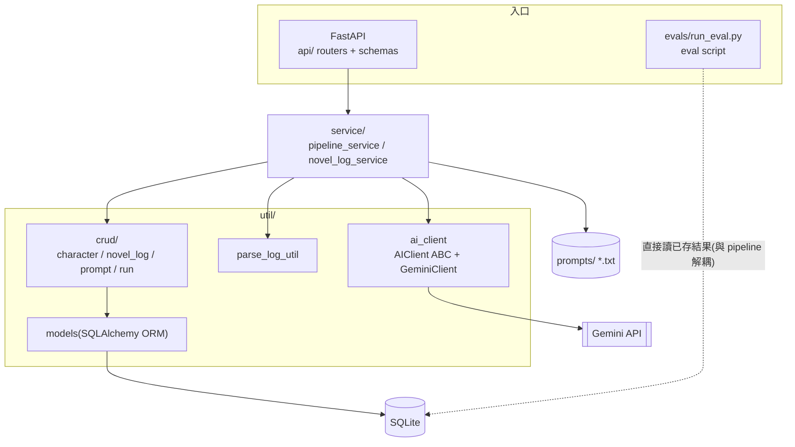

**中文** | [English](README.md)

# 中文長文本敘事解析 Pipeline

> 將長篇中文敘事文本(對話式 log)解析為結構化資料，以 LLM pipeline 批次產出摘要、時間軸、角色關係與回顧四種分析，並以解耦的規則式 eval 框架驗證輸出品質。

## 動機

長篇中文敘事文本(對話式互動小說 log)的人工整理成本很高：單一段落的分析範圍動輒七至八萬字，回顧劇情要重讀原文，追蹤角色關係與事件時間線得靠手動筆記，而且整理結果散落各處、難以累積。

本專案源於作者自身整理這類文本的實際需求，把整理流程自動化：原始 log 先經解析器結構化入庫，再由 LLM pipeline 依四種分析目的(summary / timeline / relationship / recap)批次產出結果並存入資料庫——分析結果因此可查詢、可累積、可重跑，也成為後續 eval 的資料來源。

## 架構

分層設計，職責單向依賴(入口 → 業務邏輯 → 資料存取)：



| 層 | 職責 |
|---|---|
| `api/` | FastAPI 入口：routers(character / novel_log / run)+ Pydantic v2 schemas |
| `service/` | 業務邏輯：pipeline 執行(run_pipeline)、prompt 組裝、執行結果入庫 |
| `util/` | 基礎設施：ai_client(Provider 抽象 + Gemini 實作)、log 解析、DB 連線、ORM models |
| `util/crud/` | DAO 層：各表的資料存取，commit 由呼叫方負責 |

另有 `prompts/`(prompt 純文字檔，system instruction 與 prompt 區段分離)、`evals/`(規則函式 + script 入口)。

**雙入口設計**：開發者批次操作走 script(`service/novel_log_service.py` 的解析入口、`evals/run_eval.py`)，服務化與互動測試走 API(Swagger)。

**技術棧**：Python 3.13、FastAPI、SQLAlchemy ORM、SQLite、Pydantic v2、google-genai

## 設計決策

### Eval 與 pipeline 解耦

Eval 不在生成流程內做，而是獨立的開發者工具：`evals/run_eval.py` 直接從 `prompt_execution.result_content` 讀取已入庫的結果做規則檢查，**不重打 LLM API**。這帶來三個性質：

- 對同一批歷史結果可以反覆跑新規則，零額外 API 成本、不佔 quota
- 驗證邏輯的增修完全不影響 pipeline 本身
- 入口是 script 而非 API endpoint——eval 是開發者的品質工具，不是產品功能

目前的規則是 `length_check`(輸出長度上限檢查，`--execution-id` / `--limit` 由 CLI 指定);規則庫刻意從最簡單的一條開始，先驗證「解耦架構 + 讀庫檢查」這條路走得通，更多規則與 LLM-as-judge 見 Roadmap。

### AI Provider 抽象

`ai_client` 以 `AIClient` 抽象基底類別定義介面，`GeminiClient` 為目前唯一實作。業務邏輯只依賴抽象，更換或增加模型供應商(如本地 Ollama)不動 service 層。

### Prompt 外置為純文字檔

四種分析的 prompt 放在 `prompts/` 下的 txt 檔，以 `# system instruction` 與 `# prompt` 區段分離。prompt 迭代是高頻操作，外置後調整措辭不需動程式碼、diff 也乾淨。

### Schema 預留重跑追溯

`prompt_execution` 表以 `parent_exec_id` 自關聯：未來對失敗或品質不佳的執行做 rerun 時，新舊執行可以串成追溯鏈，而不是覆蓋或斷開歷史。分析範圍則由 `run` 表的 `range_type` / `range_start` / `range_end` 定義，同一角色可建立多個不同範圍的分析批次。

## Quickstart

以附帶的虛構範例資料(約 5,000 字)走完「解析入庫 → pipeline 四種分析 → eval」全流程。實際使用情境中，單一段落的分析範圍可達 7–8 萬字。

範例已附帶一組預先產生的分析結果，因此**核心流程(初始化 → eval)不需 Gemini API key**;只有想自己重新呼叫 LLM 生成時才需要金鑰(見下方「選用：自行重跑生成」)。

環境需求：Python 3.13。

```bash
# 1. 安裝
python -m venv venv
source venv/bin/activate
pip install -r requirements.txt

# 2. 初始化範例資料(範例角色、分析批次、四筆預先產生的分析結果;可重複執行)
python -m scripts.seed
```

**3. 跑 eval**(讀取已入庫的範例結果，不重打 API，免金鑰)：

範例結果對應的 `execution_id`(seed 依 `examples/results/` 檔名順序載入)：

| execution_id | 分析類型 |
|---|---|
| 1 | recap(劇情回顧) |
| 2 | relationship(角色關係) |
| 3 | summary(摘要) |
| 4 | timeline(時間軸) |

```bash
python -m evals.run_eval --execution-id 1 --limit 2000
```


### 選用：啟動 API 瀏覽與匯入 log(免金鑰)

```bash
uvicorn api.app:app --reload
```

開啟 Swagger UI:<http://127.0.0.1:8000/docs>


**匯入範例 log**`POST /novel_logs/import`，上傳 `examples/sample_log.txt`(`character_id=1`;`user_name` 任意值即可，為未來使用者機制預留的欄位)，回傳匯入筆數並寫入 `novel_log`。此步展示解析器，不需 API key。


### 選用：預覽 prompt 內容(免金鑰)

想先看 pipeline 實際組出的 prompt、但不呼叫 LLM，可用 preview：

`POST /runs/{run_id}/preview`——對 seed 建立的分析批次組出四種 prompt 並寫入 `data/debug_log/{timestamp}/`，**不呼叫 Gemini、不寫入資料庫**，回傳寫出的 debug 檔路徑。與下方 `execute` 走同一條 pipeline，差別只在 preview 不打 API、不入庫，因此免金鑰即可檢視 prompt 組裝結果(system instruction 與 prompt 分離、背景 context 填充)。

### 選用：自行重跑生成(需 Gemini API key)

上方附帶的分析結果即由此步驟產生。要自己重新生成需自備金鑰(注意：範例角色 context 未隨附本 repo，重跑輸出會與附帶結果不同，完整可重現見 Roadmap)：

```bash
cp .env.example .env   # 填入 GEMINI_API_KEY
```

`POST /runs/1/execute`——對 seed 建立的分析批次執行四種 prompt，呼叫 Gemini 並將結果寫入 `prompt_execution` 表。


## Roadmap

- **Eval 擴充**：各分析類型的 exact-match 規則、LLM-as-judge 層(judge prompt + rubric)
- **Rerun 機制**：以 `parent_exec_id` 追溯鏈實作失敗重跑;transient error(429/503)自動退避重試
- **Prompt 與 context 管理**：prompt 與角色 context 改讀 DB，朝可自訂、可管理的 prompt pipeline 系統演進
- **Provider 擴充**：基於 `AIClient` 抽象接入本地模型(Ollama)
